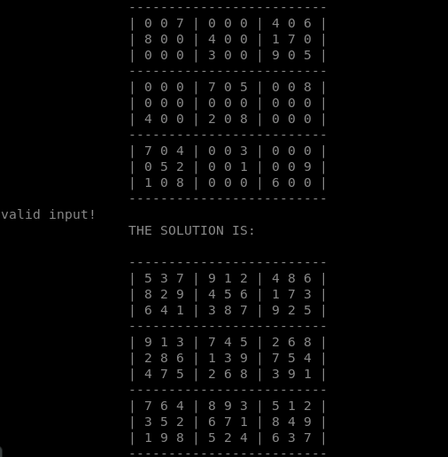

Sudoku Solver CLI
======

A simple SUDOKU solver written in C++



Introduction
------------

Sudoku is a puzzle of 9x9 numbers. There are 9 columns and 9 rows in a Sudoku. The Sudoku is further divided in to 9 equal boxes. To solve a Sudoku, each column, row and box should have a permutation of numbers from 1 to 9. There are different algorithms to solve a Sudoku such as: Backtrack solver, Rule based solver, and Boltzman machine.

### Definitions
**Cell**: Cell is the smallest square in the Sudoku puzzle. There are   
      81 cells in the puzzle.
**Box:**  A box is a square consisting of 9 cells (3x3). There are 9 
      boxes in the puzzle.
**Poss:** Possibility of numbers in a cell which will not conflict 
      with row, column or the box which the cell is in.
 

Algorithm
----------

- Insert the Sudoku. In place of empty cell insert a zero.
- Call Read function: Read the Sudoku
- Call Validate function: Validates the input Sudoku(su_in)
- Check the conflicts of possible numbers in boxes, rows and columns.
- Call Display function: Displays the input Sudoku.
- Solve function: Initialize all possibilities in an empty cell.
  -    Call Eliminate function: Eliminate all conflict 
   possibilities.
  - Call Assign function:  Assigns possibility if 
   only one possibility is present in a cell, row or a box.
  - Call Check function:  Check whether the Sudoku is solved. 
   If true return to main function else continue the loop.
  - Loop (while time<10 sec):  
```
a. Call the Guess function: Find the best cell with least possibilities.
b. Call Backup function: Back up the initial state of the Sudoku with possibilities, before performing the guess.
c. Perform the guess: Assign the first possibility of the best cell to output Sudoku (su_out).Guess_No++;
d. Loop while 10 times: Eliminate function, Assign function.
e. Loop until Conflict function: returns 0:    
     1.Guess_No--; 
     2.Call Backtrack function: 
        a) Call Restore function:
        b) Eliminate the failed possibility.
f. Call Check function: If it returned 1, break.
```
- Check the output. If solved>Display function: output. Else display> not solved.
